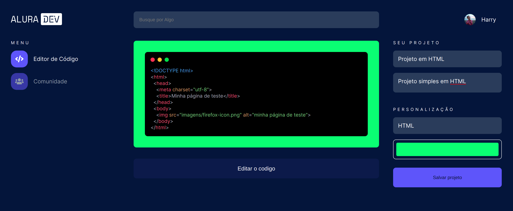

# AluraDev

O AluraDev é uma aplicação desenvolvida durante o [**Alura Challenges | Front-end**](https://www.alura.com.br/challenges/front-end/).

| Semana  | Conteúdo                                                                                                                                               |
| ------- | ------------------------------------------------------------------------------------------------------------------------------------------------------ |
| 1ª      | `Implementacao do projeto AluraDev com HTML e CSS baseado em um Figma`                                                                                 |
| 2ª      | `Uso de JavaScript para adicionar comportamento no sistema`                                                                                            |
| 3ª & 4ª | `Frameworks SPA, Integrações com APIs. Cards cada vez mais complexos, com muitas sugestões de implementação para você chegar ao avançado do Front-end` |

Esse projeto foi gerado usando o [Angular CLI](https://github.com/angular/angular-cli) versão 11.2.1.

## Instalação

Instale os pacotes `npm` descritos no` package.json` e verifique se funciona:

```shel
npm install
```

## Subir o Projeto

Execute o seguinte comando para um servidor de desenvolvimento:

```shel
ng serve
```

Navegue até `http://localhost:4200/`. O aplicativo será recarregado automaticamente se você alterar qualquer um dos arquivos de origem.

## License

[MIT](https://choosealicense.com/licenses/mit/)
